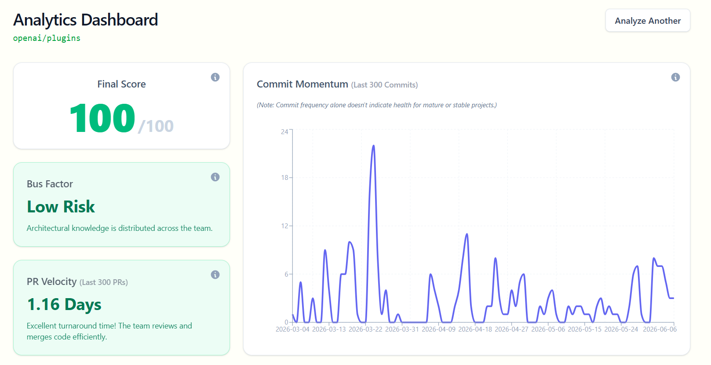
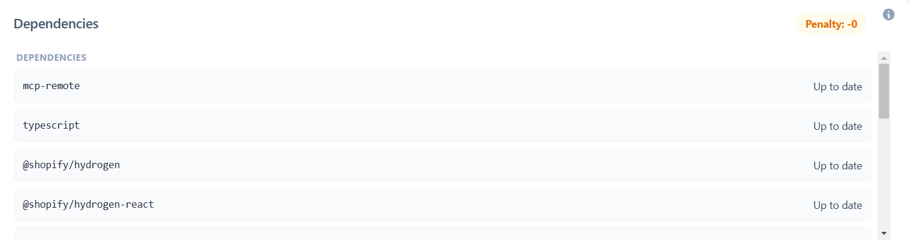

# RepoDx 
RepoDx is a repository analytics platform that ingests GitHub API data via Octokit and routes it into a separate Python backend for analysis. 
It analyzes repositories across four dimensions (commit momentum, PR velocity, bus factor risk, and dependency decay), using Z-score for commit trend analysis and the Herfindahl-Hirschman Index (HHI) for contributor concentration risk.

### 🔗 Link
https://www.repodx.software/

### Tech Stack

*   **Frontend**: React, Vite, Tailwindcss, Recharts
*   **Backend (Authentication & Data Fetching)**: Node.js, Express, Passport.js, Octokit, Prisma
*   **Data Analysis API**: FastAPI, Python, Numpy, Pandas
*   **Database**: PostgreSQL

### Screenshots



## To Run It Locally

>**NOTE:** In order to use this tool on private repositories, open Backend/src/routes/auth.route.js and on line 9, change "public_repo" to "repo"

### Prerequisites
Ensure you have the following versions installed on your machine:

Node.js: v22.12.0
Python: v3.14.2
PostgreSQL: v16.x

To run it locally, first clone the repository

```bash
git clone https://github.com/UserInTheClouds/RepoDx.git
```
### Node Backend

Go to your GitHub account -> Settings -> Developer Settings -> OAuth Apps -> New OAuth App -> Set up the application name as anything and put homepage URL as http://localhost:3000 and put Authorization callback URL as http://localhost:3000/api/auth/github/callback

After that, click on "Generate a new client secret"
Copy the client ID and client secret and set them up in the environment file

Now, set up the environment (.env) file:
```env 
PORT=3000
DATABASE_URL=YOUR_DATABASE_URL
GITHUB_CLIENT_ID=YOUR_GITHUB_CLIENT_ID
GITHUB_CLIENT_SECRET=YOUR_GITHUB_CLIENT_SECRET
CLIENT_URL='http://localhost:5173'
GITHUB_CALLBACK_URL="http://localhost:3000"
SESSION_SECRET=YOUR_SESSION_SECRET_AS_ANYTHING
NODE_ENV="DEVELOPMENT"
```
After setting up the environment file, run these commands:

```bash
cd RepoDx/Backend
npm install
npx prisma generate
npx prisma db push
npm run dev
 ```
 ### Python Backend

 - On Windows
 ```bash 
 cd RepoDx/backend-python
python -m venv venv
venv\Scripts\activate
pip install -r requirements.txt
uvicorn app.main:app --reload
```

- On Linux/MacOS
 ```bash 
 cd RepoDx/backend-python
python -m venv venv
source venv/bin/activate
pip install -r requirements.txt
uvicorn app.main:app --reload
```

### Frontend

Set up environment file (.env)
```env 
VITE_BACKEND_URL=http://localhost:3000
```

After setting up the environment file, run these commands:

```bash 
cd RepoDx/Frontend
npm install
npm run dev
```
